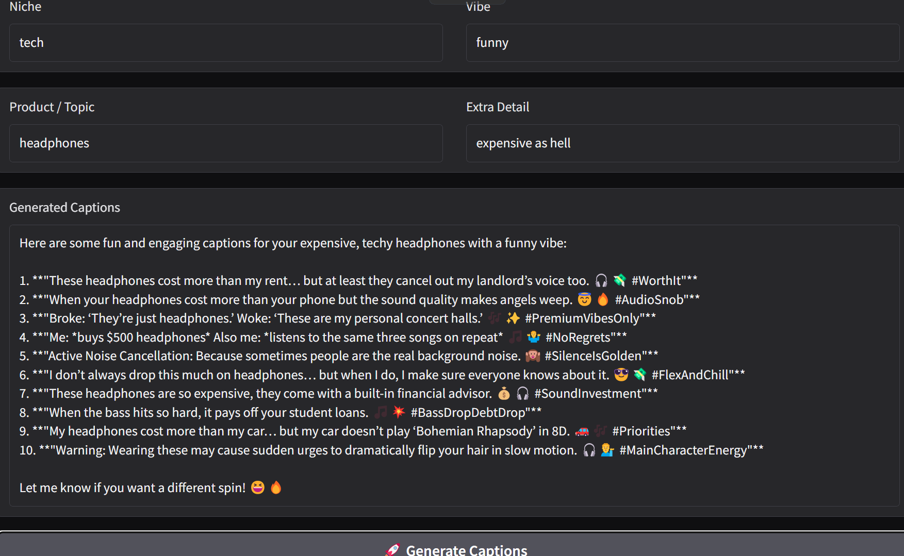

# 📸 AI Caption Generator

A simple and powerful AI tool to generate creative captions for social media posts, built using HuggingFace API and Gradio.  
**Fast. Catchy. Elite.**

---

## 🚀 Features

- 🔥 Input your niche, vibe, or product type
- 🧠 AI generates 2-3 catchy captions with emojis
- 🎨 Clean Gradio web interface
- 💬 Instantly copy and use captions for Instagram, Facebook, LinkedIn, etc.

---

## 🛠️ Built With

- Python
- Gradio
- HuggingFace API (OpenAI-compatible endpoint)

---

## 🎯 How to Run
1- Create a python file consisting the code i provided.

2- run the file

```bash
python app.py
```

3- Then open your browser and visit:

```bash
http://localhost:7860
```

4- Start generating captions instantly!


## 📸 Example Screenshot


